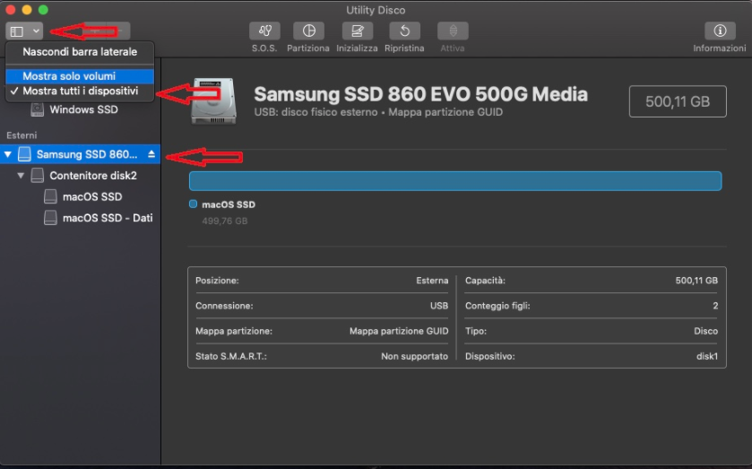
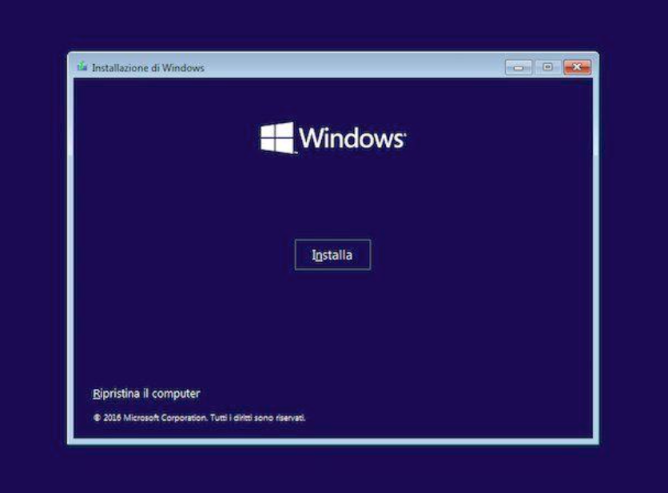
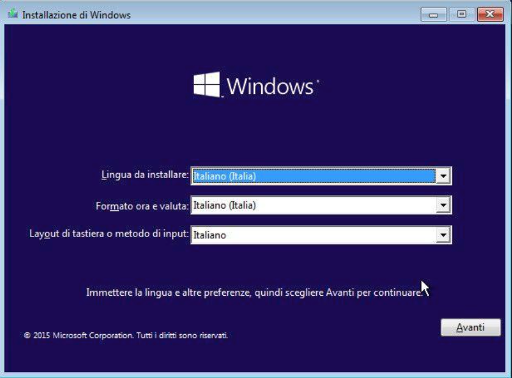
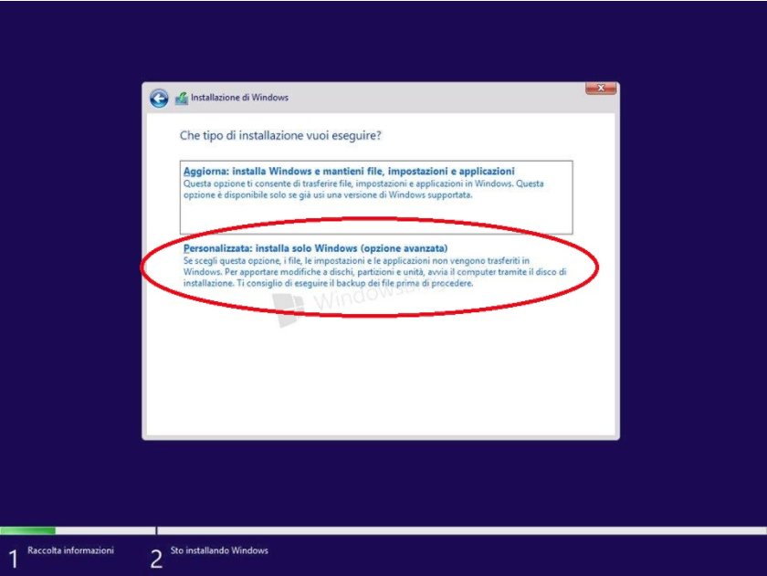
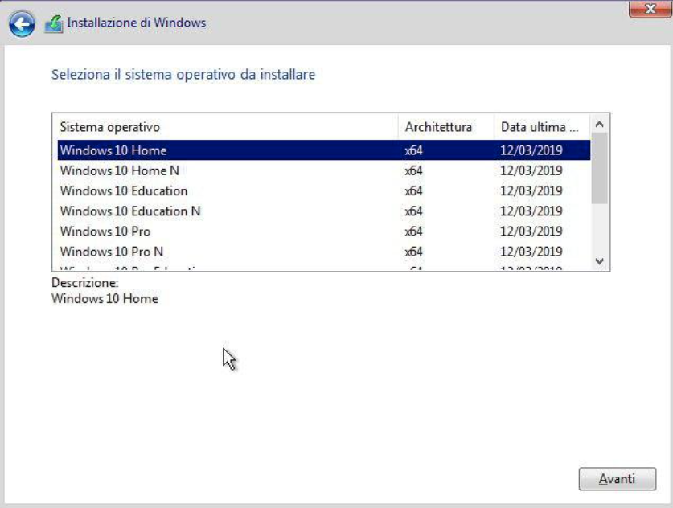
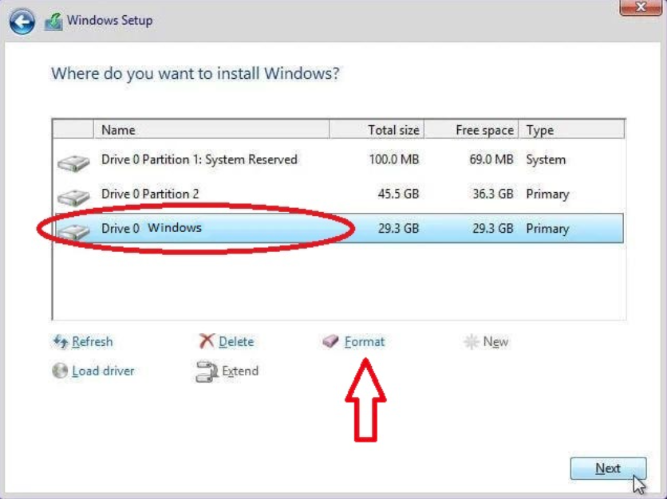
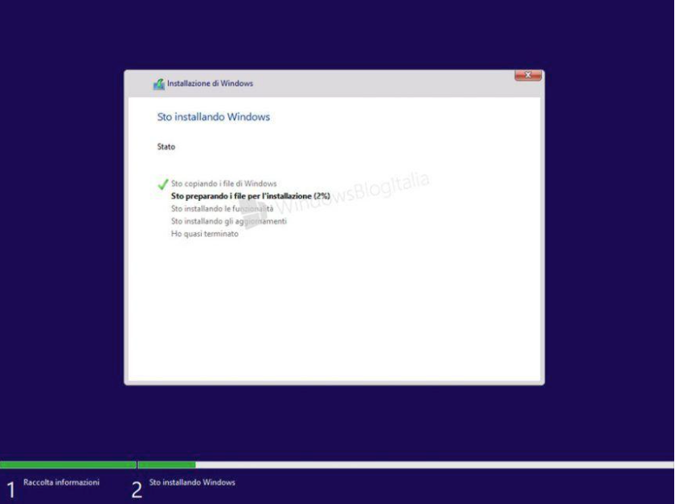

Il dual boot consiste nell'installazione di 2 Sistemi Operativi su una stessa macchina per poterli usare alternativamente. In ambito hackintosh per lo più si intende l'installazione di macOS insieme ad un altro sistema operativo come ad esempio Windows, MA BISOGNA AVER INSTALLATO MACOS PER PRIMO SE SI HA 1 SOLO SSD/HDD.

Da macOS 
Avviare da usb scegliendo la partizione di macOS.
Qui selezionare la lingua desiderata per l'installazione del sistema operativo.
Cliccare su disk utility e mostrare tutti i dischi.

Posizionarsi sul disco da formattare e partizionare.

Impostare macOS con il formato APFS e Windows in EXFAT.

Controllare se è stata partizionata.

Si Suppone abbiate già installato macOS, quindi dopo aver creato la partizione WINDOWS  seguire le foto sotto.

Windows

Avviare l’ISO di Windows dalla USB.

